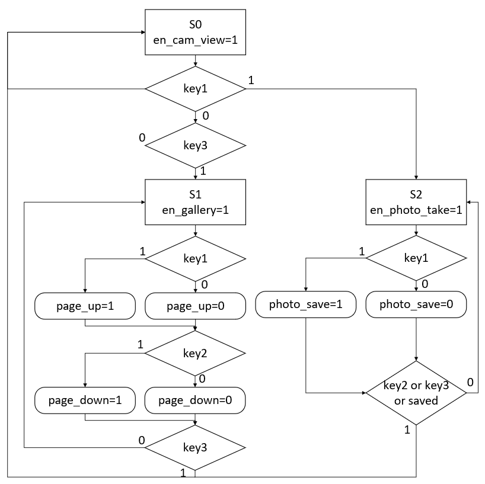

# 数字系统设计课程设计
张文浩、林志辉、张家乐

	源代码文件及说明均在Code文件夹

## 一、设计概述
本设计为一照相机，可以实现显示实时画面，拍照，保存照片，以及查看保存的照片的功能。

## 二、硬件平台

此次设计基于ALINX的开发平台AX301，开发板使用的是ALTERA公司的Cyclone IV系列FPGA，型号为EP4CE6F17C8。

本设计需要在摄像头接口处连接外设摄像头，插入SD卡和连接VGA接口。

本设计采用了VGA外接显示器的方案，实际也可在扩展口连接LCD外设。

## 三、功能描述
本设计是一照相机，主控可分成三个状态。

通电开机后直接进入待照相状态，可以在VGA连接的显示器看到摄像头拍到的实时画面。

当在待照相状态按下按键1时进入已照相待保存状态，显示可看到按下按键1时刻的静止画面。此时若再次按下按键1，则将画面显示的照片以bmp格式存到sd卡，当收到已保存的信号后就返回待照相状态；若未再次按下按键1，则在按下按键2或按键3时返回待照相状态。

当在待照相状态按下按键3时进入看图库状态，会逐个读取SD卡中的BMP图片，并在显示器中显示读到的图片，当按下按键2时显示下一张图片，按下按键1时显示上一张图片，按下按键3时返回待照相状态。

## 四、模块划分

按键输出信号到主控用于激活状态转换或者功能；
摄像头模块处理从摄像头输入的数据，输出画面信息的数据和写请求到主控；

SD卡模块根据模式可从SD卡输出图像信息到主控和把图像数据写入SD卡；

VGA模块输出画面数据和VGA视频时序到VGA接口，以及输出读请求到主控；

SDRAM模块用于高速读写，同时读写图像数据；

主控模块汇总从摄像头、SD卡和SDRAM输入的数据，输出SDRAM的读写地址和图像显示或保存的数据。

	设计中部分模块的某些部分源于或修改自ALINX公司的开源例程。

